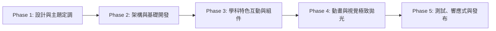

# 2026 教師節卡片網站開發計畫 (Teacher's Day Card Web App)

本專案旨在為三位不同領域的老師（**數學**、**歷史**、**公民**）打造專屬、充滿學科特色與情感共鳴的數位互動賀卡網站。
賀卡顯示前有五問題要由老師回答，都答完才能看賀卡。

---

## 總覽與開發階段 (Phases)



### 階段一：視覺設計與主題定調 (Phase 1: Design & Theming) - 當前階段
- [ ] 確立三位老師的設計風格矩陣（色系、字型、意象語彙）。
- [ ] 規劃卡片互動形式（例：3D 雙面翻轉卡、卷軸展開、或是信封拆封動畫）。
- [ ] 定義學科專屬彩蛋與視覺裝飾元件（數學公式、歷史古卷紋理、公民憲章印章）。
- [ ] 產出設計規範與 CSS 變數定義。

### 階段二：專案架構與基礎開發 (Phase 2: Architecture & Setup)
- [ ] 建立乾淨、模組化的 Web 專案結構（HTML5 + 現代 Vanilla CSS + ES Modules 原生 JS）。
- [ ] 建立共用版面框架：全螢幕質感背景、主題切換器（數學 / 歷史 / 公民切換 Tab 或入口選擇門）。
- [ ] 整合 Google Fonts（繁體中文 Noto Sans/Serif TC 搭配高質感英文字型）。

### 階段三：卡片核心與學科互動實作 (Phase 3: Subject-Specific Features)
- [ ] **數學卡片 (The Mathematical Elegance)**：
  - 坐標系/網格動態背景、黃金比例排版。
  - 「Q.E.D.（證明完畢）」或數學公式拆解祝詞。
  - 互動彩蛋：微型幾何生成或解謎按鈕。
- [ ] **歷史卡片 (The Chronological Voyage)**：
  - 復古羊皮紙質地、時光軸線、典雅封蠟印章（Wax Seal）互動。
  - 「載入史冊」的真摯賀詞書寫。
  - 互動彩蛋：時光指針撥動或揭開歷史卷軸效果。
- [ ] **公民卡片 (The Agora & Civic Light)**：
  - 現代開放講堂（Agora）氛圍、明亮色塊與溫暖漸層。
  - 多元與公民思辨金句卡片、投票箱/點亮火炬祝福互動。
  - 互動彩蛋：寫下感謝關鍵字並生成共感文字雲或紀念徽章。

### 階段四：動效與微交互拋光 (Phase 4: Animation & Polish)
- [ ] 開場進場動畫（Smooth Entrance Animation）。
- [ ] 擬真信封拆封、紙質質感陰影與 3D 傾斜視差（Parallax Tilt）效果。
- [ ] 音效與動態微回饋（翻頁聲、按鈕微震動或輕微音效，可靜音開關）。
- [ ] 一鍵截圖下載專屬卡片（HTML5 Canvas 生成圖檔分享）或複製祝福連結。

### 階段五：跨裝置調校與交付發布 (Phase 5: Responsive & Delivery)
- [ ] 手機版（Mobile First）、平板與桌面端 RWD 完美適配。
- [ ] 跨瀏覽器相容性測試（Safari / Chrome / Edge / Firefox）。
- [ ] 部署上線（靜態託管如 GitHub Pages / Vercel）與交付給老師。

---

## 總體架構說明

## 資料夾結構
```
│ index.html -> 入口網站，供選項引導老師進入該科目的網頁
| global
|  ├─── src
|       └─── 照片素材
|  ├─── global.js -> 包含問題列表
|  └─── global.css
| history
|  ├─── history.html
|  └─── history.css
| civics
|  ├─── civics.html
|  └─── civics.css
| mathematic
|  ├─── mathematic.html
|  └─── mathematic.css
```

### 問題列表
  - 建立三個HTML檔案給三個老師
  - 在JS中建立問題列表陣列，由HTML呼叫動態載入問題列表

## 三學科字體與色彩規範詳解 (Design Specs)

### 1. 數學 (Mathematics) — 「理性的浪漫與極致精確」
- **設計哲學**：坐標幾何、藍圖藍、幾何極簡、黃金分割、純粹邏輯。
- **字型搭配**：
  - **中文標題/內文**：`Noto Sans TC` (思源黑體) / 幾何無襯線黑體（乾淨、筆劃俐落無冗贅）
  - **英文/符號/公式**：`JetBrains Mono` / `Space Mono`（代碼與等寬精準感）搭配 `Outfit`（幾何現代標題）
- **色盤設定 (Color Palette)**：
  - 主背景色：`#0A1128` (深邃藍圖海軍藍 - Deep Blueprint)
  - 輔助次色：`#1C2D5A` (坐標階層藍 - Coordinate Slate)
  - 強調亮點色：`#38BDF8` (電子青藍 - Vector Cyan)
  - 溫暖點綴色：`#F59E0B` (黃金比例金 - Golden Ratio Gold)
  - 文字主色：`#F8FAFC` (粉筆皓白 - Chalk White)

### 2. 歷史 (History) — 「文人典雅手卷與墨韻沉香」
- **設計哲學**：古代雙軸手卷、藏青雲錦裝裱、米黃熟宣紙、漢簡隸書、橫批題跋、秦漢朱印。
- **互動機制**：初始為雙實木軸桿併攏於中央，繫有絲絛紅繩與「致 歷史老師 · 啟卷」直式題簽；點擊後雙軸滑順向左右展開，如古代長卷般鋪開宣紙祝詞。再次點擊可重新收攏。
- **字型搭配**：
  - **中文標題/內文**：`LiSu` (漢簡隸書 / 蠶頭燕尾，端莊沉穩，具金石碑帖之美)，搭配 `Ma Shan Zheng` / `Noto Serif TC`
  - **印章/題簽**：漢印朱砂篆刻體（引首章「啟智」+ 壓角方印「師恩如山」）
- **色盤設定 (Color Palette)**：
  - 外層裝裱：`#162B3D` (藏青雲錦 - Indigo Brocade)
  - 內芯宣紙：`#F7F3E8` (米黃熟宣 - Aged Rice Paper)
  - 軸頭金線：`#C5A059` (青銅鎏金 - Antique Bronze Gold)
  - 文字主色：`#1A120B` (古徽焦墨 - Pine Soot Ink)
  - 印章印泥：`#B82222` (秦漢朱砂 - Han Imperial Cinnabar)

### 3. 公民 (Civics) — 「開放的講堂與思辨之光」
- **設計哲學**：古希臘阿哥拉（Agora）、民主廣場、陽光、多元包容、社會行動力。
- **字型搭配**：
  - **中文標題/內文**：`Noto Sans TC`（加重字重 Medium/Bold，親切直率，具公共演說力量）
  - **英文/標語**：`Plus Jakarta Sans` / `Montserrat`（當代公民社會、國際視野與清晰可讀性）
- **色盤設定 (Color Palette)**：
  - 主背景色：`#0F172A` (夜幕論壇深灰 - Civic Night) 搭配活力漸層
  - 輔助次色：`#0284C7` (民主晴空藍 - Liberty Blue)
  - 強調亮點色：`#0D9488` (多元翡綠 - Agora Teal)
  - 溫暖點綴色：`#F97316` / `#FBBF24` (啟蒙之光暖橘 - Enlightenment Amber)
  - 文字主色：`#F1F5F9` (明晰純白 - Clarity Slate)
